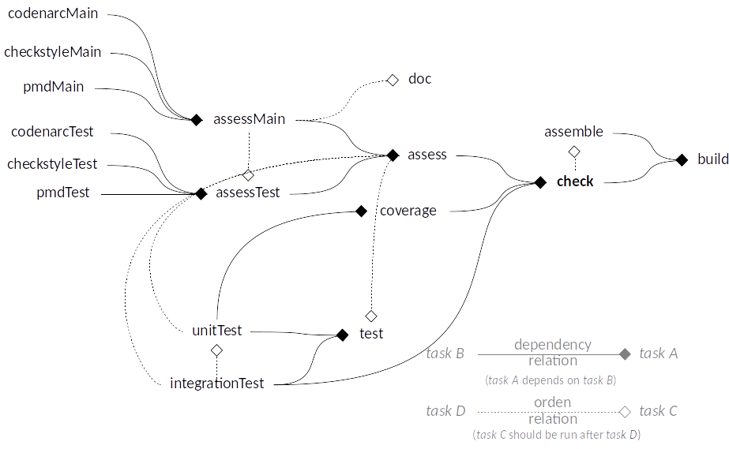

# Code's Common Tasks

[](/LICENSE.txt) [](https://bintray.com/gmullerb/all.shared.gradle/code-common-tasks/_latestVersion)

**This project offers a Common Set of Gradle's Tasks for Backend's and Frontend's Development**.

This project is licensed under the terms of the [MIT license](/LICENSE.txt).

## Goal

Have a "same" set of Gradle's Tasks for Backend's development and Frontend's development, i.e. same tasks names and  "same" tasks functionality, in order to reduce difference between projects and this way facilitated the work of Backend's developers and Frontend's developer, who will be able to move between projects easily.

## Features

* Convention over Configuration for Backend and Frontend projects:
  * Adds some tasks based on present tasks.
  * Automatically complements some existing tasks.
    * Adds relationships when some tasks are present.
    * Adds tasks description if not present or empty.
    * Logs result's location for some tasks.

## Using/Configuration

### Convention over Configuration

#### Tasks & Groups

**Code Assessment** group: contains code assessment tasks:

* `assess` task: for assessing the code (Main and Test).
  * It will be automatically created if it does not exist, and `assessMain`, `assessTest` or `assessLocal` are present.
  * It will depend on:
    * `assessMain`, if present.
    * `assessTest`, if present.
    * `assessLocal`, if present.
* `assessMain` task: for assessing Main code.
  * It will be automatically created if it does not exist and `codenarcMain`, `checkstyleMain`, `pmdMain` or `assessCss` are present.
  * It will depend on:
    * `codenarcMain`, if present.
    * `checkstyleMain`, if present.
    * `pmdMain`, if present.
    * `assessCss`, if present.
* `assessTest` task: for assessing Test code (Unit and Integration).
  * It will be automatically created if it does not exist, and `assessUnitTest`, `assessIntegrationTest`, `codenarcTest`, `checkstyleTest` or `pmdTest` are present.
  * It will depend on:
    * `assessUnitTest`, if present.
    * `assessIntegrationTest`, if present.
    * `codenarcTest`, if present, and `assessUnitTest` or `assessIntegrationTest` are not defined.
    * `checkstyleTest`, if present, and `assessUnitTest` or `assessIntegrationTest` are not defined.
    * `pmdTest`, if present, and `assessUnitTest` or `assessIntegrationTest` are not defined.
  * It will run after:
    * `assessMain`, if present.
* `assessUnitTest` task: for assessing Unit Test code.
  * It will run after:
    * `assessMain`, if present.
* `assessIntegrationTest` task: for assessing Integration Test code.
  * It will run after:
    * `assessMain`, if present.
    * `assessUnitTest`, if present.

**Code Testing** group: contains code testing tasks:

* `test` task: for running tests.
  * It will be automatically created if it does not exist, and `unitTest` or `integrationTest` are present.
  * It will depend on:
    * `unitTest`, if present.
    * `integrationTest`, if present.
  * It will run after:
    * `assessTest`, if present.
* `unitTest` task: for running unit test.
  * It will run after:
    * `assessUnitTest`, if present.
    * `assess`, if present, and `assessUnitTest` is not present.
* `integrationTest` task: for running integration test.
  * It will run after:
    * `assessIntegrationTest`, if present.
    * `assess`, if present, and `assessIntegrationTest` is not present.

**Code Verification** group: contains code verification tasks:

* `coverage` task: for calculating and analyzing code coverage.
  * It will be automatically created if it does not exist, and `test`, `jacocoTestReport` or `jacocoTestCoverageVerification` are present.
  * It will depend on:
    * `unitTest`, if present.
    * `test`, if `unitTest` is not present.
* `check` task: for running all checks: assessments and tests.
  * It will be created if it does not exist and `assess`, `test`, `coverage` or `integration` are present.
  * It will depend on:
    * `coverage`, if present.
    * `integrationTest`, if present, and `coverage` present.
    * `test`, if `coverage` is not present.

**Build** group: contains binaries building tasks:

* `assemble` task: for assembling binaries.
  * It will run after:
    * `check`, if present.
* `build` task: the master task that will do all the checks and assemble binaries.
  * It will be created if it does not exist and `assemble` is present.
  * It will depend on:
    * `assemble`, if present.
    * `check`, if present.

**Code Documentation** group: contains documentation building tasks:

* `doc` task: for assembling code documentation.
  * It will be automatically created if it does not exist, and `javadoc` or `groovydoc` are present.
  * It will run after:
    * `assessMain`, if present.
    * `assess`, if present, and `assessMain` not present.

The following shows all the Tasks relationships:

* Some relationships are conditional based on existence of other tasks (are show in blue).


Different variations can be generated depending on what is defined, e.g.:

* Project with unit tasks and integration tasks:


* Project with unit tasks, integration tasks and coverage:


* Project with unit tests and integration tests:


* Project without unit tests and without integration tests:


* Project with external tools:



* Minimal project with build:


* Minimal project:


These values are defined in [`CodeCommonTasksExtension`](src/main/groovy/all/shared/gradle/code/CodeCommonTasksExtension.groovy), and although the idea is to use convention, these values are available anc can be configurable though the `codeCommonTasks` extension added when this plugin is applied:

* Groups names.
* Task names.
* External tool to search for.

```groovy
  codeCommonTasks.groupForAssessTasks = 'Code Assessment'
  codeCommonTasks.assessTask = 'assess'
  codeCommonTasks.assessMainTask = 'assessMain'
  codeCommonTasks.assessTestTask = 'assessTest'
  codeCommonTasks.assessUnitTestTask = 'assessUnitTest'
  codeCommonTasks.assessIntegrationTestTask = 'assessIntegrationTest'
  codeCommonTasks.tasksForAssess = ['assessMain', 'assessTest', 'assessLocal']
  codeCommonTasks.tasksForMainAssess = ['codenarcMain', 'checkstyleMain', 'pmdMain', 'assessCss']
  codeCommonTasks.tasksForTestAssess = ['codenarcTest', 'checkstyleTest', 'pmdTest']
  codeCommonTasks.tasksForCoverage = ['jacocoTestReport', 'jacocoTestCoverageVerification']
  codeCommonTasks.tasksForDocumentation = ['javadoc', 'groovydoc']

  codeCommonTasks.groupForTestTasks = 'Code Testing'
  codeCommonTasks.testTask = 'test'
  codeCommonTasks.unitTestTask = 'unitTest'
  codeCommonTasks.integrationTestTask = 'integrationTest'

  codeCommonTasks.groupForVerificationTasks = 'Code Verification'
  codeCommonTasks.checkTask = 'check'
  codeCommonTasks.coverageTask = 'coverage'

  codeCommonTasks.groupForBuildTasks = 'Build'
  codeCommonTasks.assembleTask = 'assemble'
  codeCommonTasks.buildTask = 'build'

  codeCommonTasks.groupForDocumentationTasks = 'Code Documentation'
  codeCommonTasks.documentationTask = 'doc'
```

### Prerequisites

* None

### Gradle configuration

1. Apply the plugin:

```gradle
 plugins {
   id 'all.shared.gradle.code-common-tasks' version '1.0.0'
 }
```

Due to delays in the approval on [Gradle Plugin Repository](https://plugins.gradle.org/u/gmullerb)[1], is possible that the plugin is not available from there, consequently, add following to `settings.gradle`:

```gradle
  pluginManagement {
    repositories {
        gradlePluginPortal()
        maven {
          url 'https://dl.bintray.com/gmullerb/all.shared.gradle'
        }
    }
  }
```

> [1] Waited around 5 days for publish's approval of the plugin without answer (new policies and more delays).  
> [1] Due to new Gradle Plugin Repository policies, delays of several days, without answer, for approval of the plugin publication can happen.
> For an actual use example, see [basecode - settings.gradle](https://github.com/gmullerb/basecode/blob/master/settings.gradle).

#### Using only applying plugins

This will work for Backend development, since Frontend will require some customization.

2 . Apply language plugins:

Groovy:

```gradle
 plugins {
   id 'groovy'
 }
```

Java:

```gradle
 plugins {
   id 'java'
 }
```

2 . Apply code styling plugins:

Groovy:

```gradle
 plugins {
   id 'codenarc'
 }
```

Java:

```gradle
 plugins {
   id 'checkstyle'
 }
```

and/or

```gradle
 plugins {
   id 'pmd'
 }
```

3 . Define source folder structure:

Groovy:

```
  /src
    /main
      /groovy
    /test
      /groovy
```

Java:

```
  /src
    /main
      /java
    /test
      /java
```

4 . Add code.

5 . Run `gradlew build`

With Coverage

6 . Apply [JaCoCo](http://www.eclemma.org/jacoco) plugins:

```gradle
 plugins {
   id 'jacoco'
 }
```

7 . Configure jacoco plugin and/or tasks.

> To see all the tasks added to the project: `gradlew tasks`.  
> For an actual use example, see this project.

### Customize use

1 . Define some of the tasks with the required values, e.g.:

```gradle
  task assessUnitTest {
    dependsOn checkstyleUnitTest, pmdUnitTesTask
  }
```

2 . The plugin will automatically complement tasks that has the ["predefined" names](#Tasks-&-Groups).

* If the task description is empty then a description is added.

3 . If the predefined name is not adequate the use `codeCommonTasks` extension to change the "predefined name", e.g.:

```gradle
  codeCommonTasks.assessUnitTestTask = 'assessUnitTestNewName'
```

4 . If the task has a name which is not "predefined", then use complement methods from `codeCommonTasks` extension, e.g.:

```gradle
  task someAssessUnitTest {
    dependsOn checkstyleUnitTest, pmdUnitTesTask
  }
  codeCommonTasks.complementAssessUnitTestTask(someAssessUnitTest)
```

Following complement methods are available:

* `void complementAssessTask(Task task)`
* `void complementAssessMainTask(Task task)`
* `void complementAssessTestTask(Task task)`
* `void complementAssessUnitTestTask(Task task)`
* `void complementAssessIntegrationTestTask(Task task)`
* `void complementTestTask(Task task)`
* `void complementUnitTestTask(Task task)`
* `void complementIntegrationTestTask(Task task)`
* `void complementCoverageTask(Task task)`
* `void complementCheckTask(Task task)`
* `void complementAssembleTask(Task task)`
* `void complementBuildTask(Task task)`
* `void complementDocumentationTask(Task task)`

> For an actual use example, see , [basecode - back project](https://github.com/gmullerb/basecode/tree/master/back), [basecode - front project](https://github.com/gmullerb/basecode/tree/master/front) and [basecode - e2e project](https://github.com/gmullerb/basecode/tree/master/front/e2e).

#### Result locations

For Test report location in `unitTest`, `integrationTest` or `test` tasks, define `reportAt`, e.g.:

* if the Task is an instance of [AbstractTestTask](https://docs.gradle.org/current/javadoc/org/gradle/api/tasks/testing/AbstractTestTask.html) the value is automatically "set".
  * `reportAt` overrides this values.

```gradle
task unitTest(type: Test) {
  ext.reportAt = ..
}
```

For Coverage report location in `unitTest` or `test` tasks, define `coverageReportAt`, e.g.:

* For some external tools defined in `codeCommonTasks.tasksForCoverage` these values are automatically "set":
  * jacocoTestReport.
  * `coverageReportAt` overrides this values.

```gradle
task unitTest(type: Test) {
  ext.coverageReportAt = ..
}
```

For Documentation in `doc` tasks, define `documentationAt` and `documentationType`, e.g.:

* For some external tools defined in `codeCommonTasks.tasksForDocumentation` these values are automatically "set":
  * javadoc.
  * groovydoc.
  * `documentationAt` overrides this values.

```gradle
task doc() {
  ext.documentationType = 'jsDoc'
  ext.documentationAt = "$buildDir/docs"
}
```

## Extending/Developing

### Prerequisites

* [Java](http://www.oracle.com/technetwork/java/javase/downloads).
* [Git](https://git-scm.com/downloads) (only if you are going to clone the project).

### Getting it

Clone or download the project[1], in the desired folder execute:

```sh
git clone https://github.com/gmullerb/gradlegpluginbasecode
```

> [1] [Cloning a repository](https://help.github.com/articles/cloning-a-repository/)

### Set up

* **No need**, only download and run (It's Gradle! Yes!).

### Folders structure

```
  /src
    /main
      /groovy
    /test
      /groovy
```

- `src/main/groovy`: Source code files.
  - [CodeCommonTasksExtension](src/main/groovy/all/shared/gradle/code/CodeCommonTasksExtension.groovy) extension of the plugin.
  - [CodeCommonTasksCreateTasksAction](src/main/groovy/all/shared/gradle/code/CodeCommonTasksCreateTasksAction.groovy) where tasks are created.
  - [CodeCommonTasksComplementAction](/media/COMMON/code/my/code-common-tasks/src/main/groovy/all/shared/gradle/code/CodeCommonTasksComplementAction.groovy) where tasks are complemented.
- `src/test/groovy`: Test code files[1].

> [1] Tests are done with [JUnit](http://junit.org) and [Mockito](http://javadoc.io/page/org.mockito/mockito-core/latest/org/mockito/Mockito.html).

### Building it

* To build it:
  * `gradlew build`.
  * `gradlew`: this will run default tasks
    * `gradlew assessCommon`: will check common style of files.
    * `gradlew assessGradle`: will check code style of Gradle's.
    * `gradlew build`.

* To assess code: `gradlew assess`.

* To test code: `gradlew test`
  * This will run jacoco code coverage [1].

* To publish plugin: `./gradlew -PPLUGIN_ID=all.shared.gradle.pluginName publishPlugins`
  * `-PPLUGIN_ID` indicates the plugin id.

* To get all the tasks for the project: `gradlew tasks --all`

> [1] May not get 100% since Groovy adds some extra code, that may not be tested.

### Convention over Configuration

All `all.shared.gradle` plugins define:

* _PluginName_**Plugin**: which contains the class implements `Plugin` interface.
* _PluginName_**Extension**: which represent the extension of the plugin.
* If Tasks are define, then their names will be _TaskName_**Task**.
* If Actions are define, then their names will be _ActionName_**Action**.

All `all.shared.gradle` plugins have two **`static`** members:

* `String EXTENSION_NAME`: This will have the name of the extension that the plugin add.
  * if the plugin does not add an extension the this field will not exist.

* `boolean complement(final Project project)`: will apply the plugin and return true if successful, false otherwise.
  * this methods is **exactly equivalent to the instance `apply` method**, but without instantiate the class if not required.

Both may be useful when applying the plugin when creating custom plugins.

All `all.shared.gradle` plugins "silently" fail when the extension can not be added.

## Documentation

* [`CHANGELOG.md`](CHANGELOG.md): add information of notable changes for each version here, chronologically ordered [1].

> [1] [Keep a Changelog](http://keepachangelog.com)

## License

[MIT License](/LICENSE.txt)

## Remember

* Use code style verification tools => Encourages Best Practices, Efficiency, Readability and Learnability.
* Start testing early => Encourages Reliability and Maintainability.
* Code Review everything => Encourages Functional suitability, Performance Efficiency and Teamwork.

## Additional words

Don't forget:

* **Love what you do**.
* **Learn everyday**.
* **Learn yourself**.
* **Share your knowledge**.
* **Learn from the past, dream on the future, live and enjoy the present to the max!**.

At life:

* Let's act, not complain.
* Be flexible.

At work:

* Let's give solutions, not questions.
